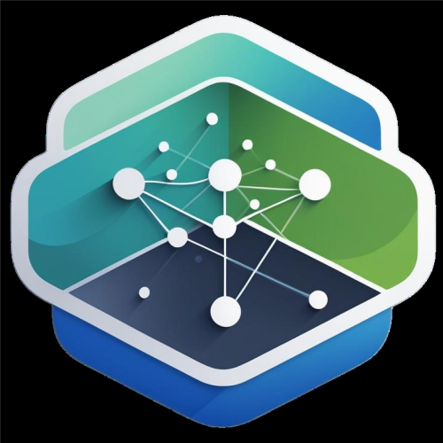

<p align="center">

</p>
<p align="center">
<span style="font-size: 25px; font-weight: bold; text-align: center; font-family: 'Montserrat', system-ui, sans-serif;" >
Backend For Migrations (BfM)
</span>
</p>

<p align="center">
<a href="https://pkg.go.dev/bfm/api/migrations"></a>
</p>

BfM is a comprehensive database migration system that supports multiple backends (PostgreSQL, GreptimeDB, Etcd) with HTTP and Protobuf APIs.

## Features

- Multi-backend support: PostgreSQL, GreptimeDB, Etcd
- HTTP REST API with authentication
- Protobuf/gRPC API (requires code generation)
- Migration state tracking in PostgreSQL/MySQL
- Support for fixed and dynamic schemas
- Embedded SQL scripts in Go files
- Dry-run mode for testing
- Idempotent migrations

## Configuration

### Environment Variables

#### Server Configuration

- `BFM_HTTP_PORT` - HTTP server port (default: 7070)
- `BFM_GRPC_PORT` - gRPC server port (default: 9090)
- `BFM_API_TOKEN` - API token for authentication (required)

#### State Database Configuration

- `BFM_STATE_BACKEND` - State database type: "postgresql" or "mysql" (default: "postgresql")
- `BFM_STATE_DB_HOST` - State database host (default: "localhost")
- `BFM_STATE_DB_PORT` - State database port (default: "5432")
- `BFM_STATE_DB_USERNAME` - State database username (default: "postgres")
- `BFM_STATE_DB_PASSWORD` - State database password (required)
- `BFM_STATE_DB_NAME` - State database name (default: "migration_state")
- `BFM_STATE_SCHEMA` - State database schema (default: "public")

#### Connection Configuration

For each connection (e.g., "core", "guard", "logs"), set:

- `{CONNECTION}_BACKEND` - Backend type: "postgresql", "greptimedb", or "etcd"
- `{CONNECTION}_DB_HOST` - Database host
- `{CONNECTION}_DB_PORT` - Database port
- `{CONNECTION}_DB_USERNAME` - Database username
- `{CONNECTION}_DB_PASSWORD` - Database password
- `{CONNECTION}_DB_NAME` - Database name
- `{CONNECTION}_SCHEMA` - Schema name (optional, for fixed schemas)

Example:

```bash
CORE_BACKEND=postgresql
CORE_DB_HOST=localhost
CORE_DB_PORT=5432
CORE_DB_USERNAME=dashcloud
CORE_DB_PASSWORD=password
CORE_DB_NAME=dashcloud
CORE_SCHEMA=core
```

## Development

For development environment setup, local development, and hot-reload configuration, see [docs/DEVELOPMENT.md](docs/DEVELOPMENT.md).

## Production Deployment

### Using Docker Image

BfM provides a production-ready Docker image that includes:
- BfM API Server (HTTP on port 7070, gRPC on port 9090)
- BfM Worker (optional, enabled via `BFM_QUEUE_ENABLED=true`)
- BfM CLI tool (available inside container)
- FfM Frontend (served via the API server)

#### Building the Production Image

Build the standalone production Docker image:

```bash
# Using Makefile
make prod-build

# Or manually
docker build -t bfm-production:latest -f docker/Dockerfile .
```

#### Running with Docker Compose (Recommended)

The easiest way to run BfM in production is using the standalone Docker Compose configuration:

1. **Create environment file:**

```bash
# Copy and edit environment variables
cp .env.example .env
```

2. **Configure environment variables:**

Set the following required variables in your `.env` file:

```bash
# API Authentication
BFM_API_TOKEN=your-secure-random-token-here

# State Database
BFM_STATE_DB_PASSWORD=your-secure-password
BFM_STATE_DB_USERNAME=postgres

# Backend Connections (configure as needed)
CORE_DB_HOST=your-postgres-host
CORE_DB_PASSWORD=your-password
CORE_DB_NAME=your-database

# Optional: Queue Configuration
BFM_QUEUE_ENABLED=false  # Set to true to enable worker
```

3. **Start the service:**

```bash
# Using Makefile
make standalone-up

# Or manually
docker compose -p bfm-standalone -f deploy/docker-compose.standalone.yml up -d --build
```

4. **Verify the service:**

```bash
# Check health
curl http://localhost:7070/health

# Check service status
make standalone-ps
# or
docker compose -p bfm-standalone -f deploy/docker-compose.standalone.yml ps
```

5. **View logs:**

```bash
# Using Makefile
make standalone-logs

# Or manually
docker compose -p bfm-standalone -f deploy/docker-compose.standalone.yml logs -f
```

6. **Stop the service:**

```bash
# Using Makefile
make standalone-down

# Or manually
docker compose -p bfm-standalone -f deploy/docker-compose.standalone.yml down
```

#### Running with Docker Run

For more control, you can run the container directly:

```bash
docker run -d \
  --name bfm-production \
  -p 7070:7070 \
  -p 9090:9090 \
  -e BFM_API_TOKEN=your-secure-token \
  -e BFM_STATE_DB_HOST=postgres \
  -e BFM_STATE_DB_PASSWORD=your-password \
  -e CORE_DB_HOST=your-postgres-host \
  -e CORE_DB_PASSWORD=your-password \
  -v /path/to/your/sfm:/app/sfm:ro \
  bfm-production:latest
```

#### Accessing the Services

Once running, you can access:

- **Frontend UI**: http://localhost:7070
- **HTTP API**: http://localhost:7070/api/v1
- **gRPC API**: localhost:9090
- **Health Check**: http://localhost:7070/health

#### Using the CLI Inside Container

The BfM CLI is available inside the production container:

```bash
# Execute CLI commands
docker exec bfm-standalone /app/bin/bfm-cli --help
docker exec bfm-standalone /app/bin/bfm-cli version

# Build migration files from SFM directory
docker exec bfm-standalone /app/bin/bfm-cli build /app/sfm --verbose
```

### BfM CLI Tool

The BfM CLI is a command-line tool for generating migration `.go` files from SQL/JSON scripts.

#### Building the CLI

```bash
# Using Makefile
make build-cli

# Or manually
cd api && go build -o ../bfm-cli ./cmd/cli
```

#### CLI Commands

**Version:**

```bash
./bfm-cli version
```

**Build Migration Files:**

Generate `.go` files from migration scripts in the SFM directory:

```bash
# Basic usage
./bfm-cli build examples/sfm

# With verbose output
./bfm-cli build examples/sfm --verbose

# Dry run (show what would be generated)
./bfm-cli build examples/sfm --dry-run

# Custom output directory
./bfm-cli build examples/sfm --output /path/to/output

# Custom path
./bfm-cli build /path/to/sfm --verbose
```

#### SFM Directory Structure

The CLI expects migration scripts in the following structure:

```
{sfm_path}/
  {backend}/
    {connection}/
      {version}_{name}.up.sql
      {version}_{name}.down.sql
      # OR for etcd
      {version}_{name}.up.json
      {version}_{name}.down.json
```

Example:

```
examples/sfm/
  postgresql/
    core/
      20250101120000_create_users.up.sql
      20250101120000_create_users.down.sql
  greptimedb/
    logs/
      20250101120000_create_metrics.up.sql
      20250101120000_create_metrics.down.sql
  etcd/
    metadata/
      20250101120000_init_config.up.json
      20250101120000_init_config.down.json
```

The CLI will generate corresponding `.go` files that embed the SQL/JSON and register migrations in the global registry.

#### Using CLI in Production

In production environments, you can:

1. **Build migrations as part of CI/CD:**

```bash
# In your build pipeline
./bfm-cli build /path/to/migrations --output /path/to/generated
go build -o bfm-server ./cmd/server
```

2. **Use in Docker builds:**

```dockerfile
# Copy migration scripts
COPY migrations/sfm /app/sfm

# Generate .go files
RUN /app/bin/bfm-cli build /app/sfm

# Build server with generated migrations
RUN go build -o bfm-server ./cmd/server
```

3. **Validate migrations before deployment:**

```bash
# Dry run to check for errors
./bfm-cli build /path/to/migrations --dry-run --verbose
```

### Production Best Practices

1. **Security:**
   - Use strong, randomly generated API tokens
   - Store credentials in secret management systems (e.g., HashiCorp Vault, AWS Secrets Manager)
   - Enable TLS/HTTPS via reverse proxy (nginx, Traefik)
   - Restrict network access to BfM API

2. **High Availability:**
   - Run multiple BfM instances behind a load balancer
   - Use PostgreSQL replication for state database
   - Implement distributed locking to prevent concurrent migrations
   - Monitor health endpoints

3. **Monitoring:**
   - Set up health check monitoring (`GET /health`)
   - Collect logs via centralized logging (ELK, Loki, etc.)
   - Track migration execution metrics
   - Alert on migration failures

4. **Backup:**
   - Regularly backup the state database
   - Version control all migration scripts
   - Test restore procedures

5. **Migration Management:**
   - Always test migrations in staging first
   - Use dry-run mode before applying migrations
   - Keep migration scripts idempotent
   - Document complex migrations

See `docs/DEPLOYMENT.md` for more detailed deployment instructions.

## Usage

### HTTP API

#### Migrate Endpoint

```bash
POST /api/v1/migrate
Authorization: Bearer {BFM_API_TOKEN}
Content-Type: application/json

{
  "target": {
    "backend": "postgresql",
    "schema": "core",
    "tables": [],
    "version": "",
    "connection": "core"
  },
  "connection": "core",
  "schema": "core",
  "environment": "",
  "dry_run": false
}
```

Response:

```json
{
  "success": true,
  "applied": ["core_users_20250101120000_create_users"],
  "skipped": [],
  "errors": []
}
```

### Health Check

```bash
GET /health
```

## Migration Scripts

Migration scripts are located in `sfm/{backend}/{connection}/` and follow the naming convention:
`{version}_{name}.up.sql` and `{version}_{name}.down.sql`

The BfM CLI generates corresponding `.go` files with the format `{version}_{name}.go` that:
1. Embed SQL/JSON files using `//go:embed`
2. Register themselves in the global registry via `init()`
3. Include both up and down migrations

Example structure:

```
sfm/
  postgresql/
    core/
      20250101120000_create_users.up.sql
      20250101120000_create_users.down.sql
      20250101120000_create_users.go  # Generated by CLI
  greptimedb/
    logs/
      20250101120000_create_metrics.up.sql
      20250101120000_create_metrics.down.sql
      20250101120000_create_metrics.go  # Generated by CLI
  etcd/
    metadata/
      20250101120000_init_config.up.json
      20250101120000_init_config.down.json
      20250101120000_init_config.go  # Generated by CLI
```

## Migration from Existing System

To migrate from the existing GORM AutoMigrate system:

1. Extract table definitions from GORM models
2. Create SQL migration scripts following the naming convention
3. Place scripts in appropriate `sfm/{backend}/{connection}/` directory
4. Register migrations via `init()` functions
5. Run migrations via HTTP API or Protobuf API

See `docs/MIGRATION_GUIDE.md` for detailed instructions.
