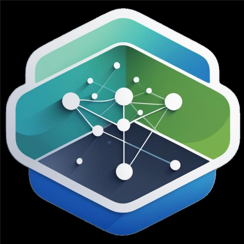
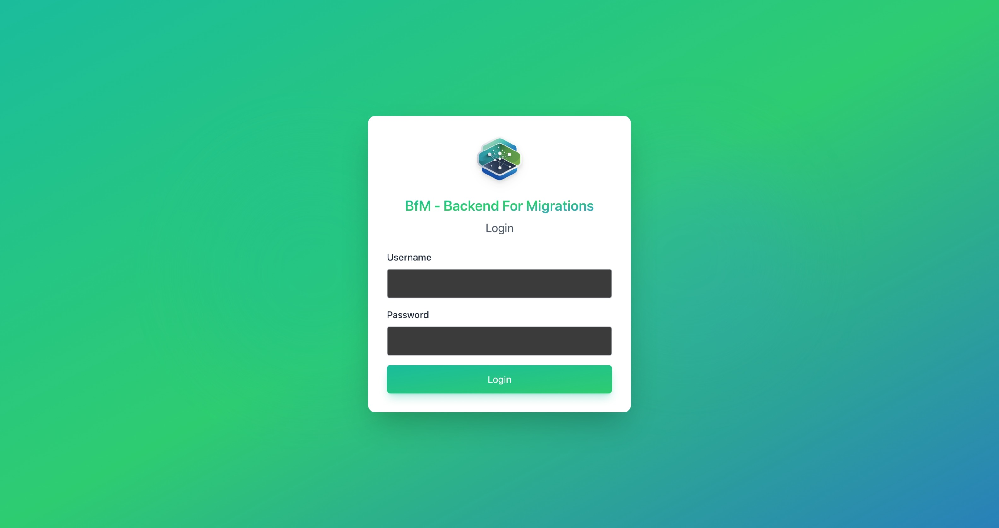
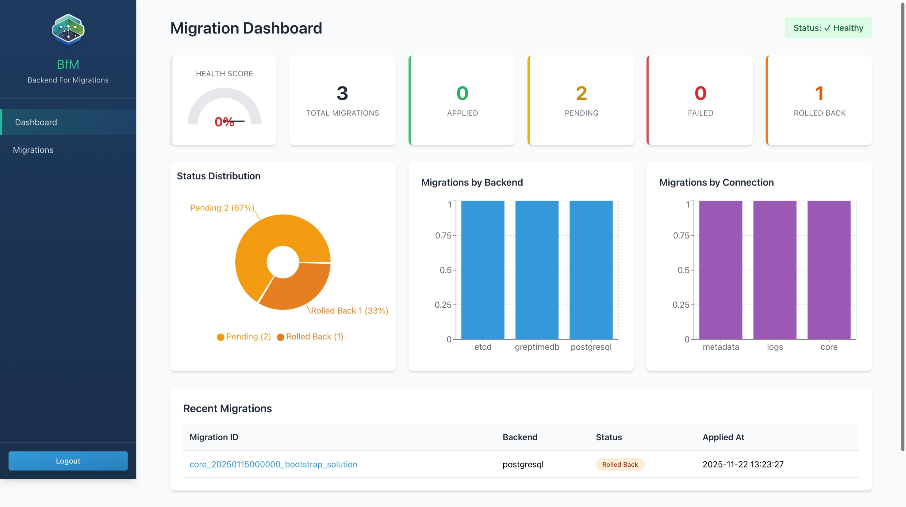
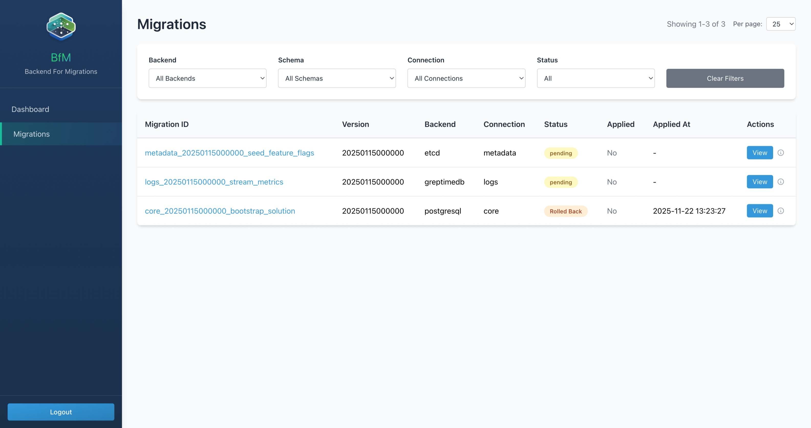
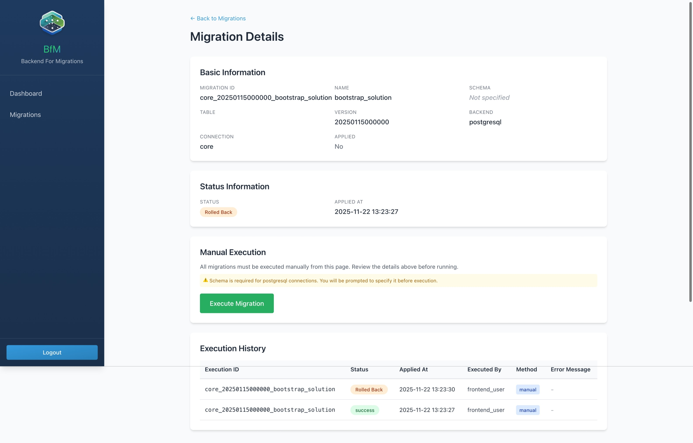

<h1 style="font-size: 25px; font-weight: bold; text-align: center; font-family: 'Montserrat', system-ui, sans-serif;" >
Backend For Migrations (BfM)
</h1>

   

## What is BfM?

**BfM (Backend for Migrations)** is a migration control plane for teams that run **PostgreSQL**, **GreptimeDB**, or **etcd** workloads. It exposes **HTTP** and **gRPC** APIs so migrations are executed in **one place** instead of from every app instance—reducing race conditions and inconsistent schema state in scaled deployments.

BfM tracks migration state in a dedicated database, supports **fixed** schemas and **per-tenant (dynamic)** schema execution, and can resolve **dependencies** and optional **`key=value` tags** when selecting what to run. A web UI (**FFM**) ships with the server for operators.

## Features

- **Multi-backend**: PostgreSQL, GreptimeDB, etcd
- **HTTP REST API** with bearer token authentication
- **gRPC API** (Protobuf definitions in-repo; see [`api/internal/api/protobuf/migration.proto`](api/internal/api/protobuf/migration.proto))
- **State tracking** (PostgreSQL/MySQL for migration metadata)
- **Fixed and dynamic schemas** (runtime schema name in the migrate request)
- **Dependency-aware execution** (expand, order, validate; optional opt-out)
- **Tag filters** (`target.tags`: `key=value` strings, AND semantics)
- **Dry-run** and idempotent operation patterns
- **Embedded SQL/JSON** in generated Go registration (build-time)
- **FFM** dashboard (migrations list, detail, manual runs)

## Screenshots

| | |
|---|---|
|  |  |
|  |  |

## Documentation

| Document | Purpose |
|----------|---------|
| [docs/TAGS.md](docs/TAGS.md) | **Tag-filtered migrate** over HTTP and gRPC (dynamic schema, AND tags). |
| [docs/MIGRATION.md](docs/MIGRATION.md) | **Run migrations** over HTTP and gRPC: targets, dependencies, dynamic schema, batch ordering. |
| [docs/EXECUTING_MIGRATIONS.md](docs/EXECUTING_MIGRATIONS.md) | Operational checklist, IDs, troubleshooting (registry vs state DB). |
| [docs/MIGRATION_DEPENDENCIES.md](docs/MIGRATION_DEPENDENCIES.md) | **Authoring** dependencies in Go/SQL (not API-focused). |
| [docs/DEPLOYMENT.md](docs/DEPLOYMENT.md) | Production setup, env vars, Docker, auto-migrate. |
| [docs/DEVELOPMENT.md](docs/DEVELOPMENT.md) | Local dev, hot-reload, CLI build, protobuf generation. |

**Machine-readable API**: OpenAPI at `/api/v1/openapi.yaml` and `/api/v1/openapi.json` on the HTTP port (default `7070`).
